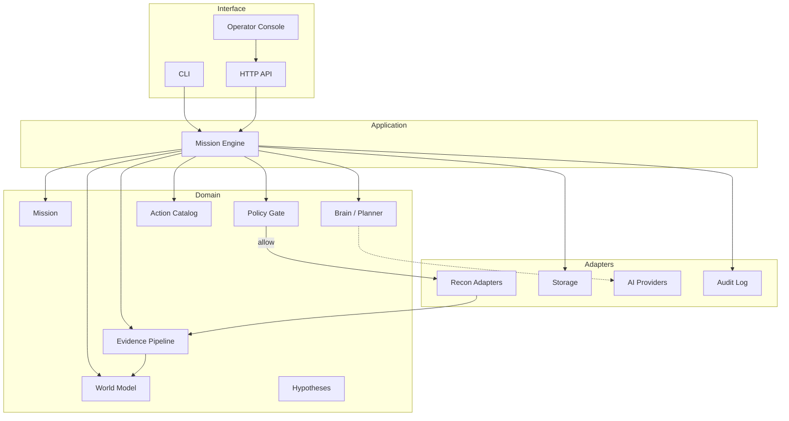
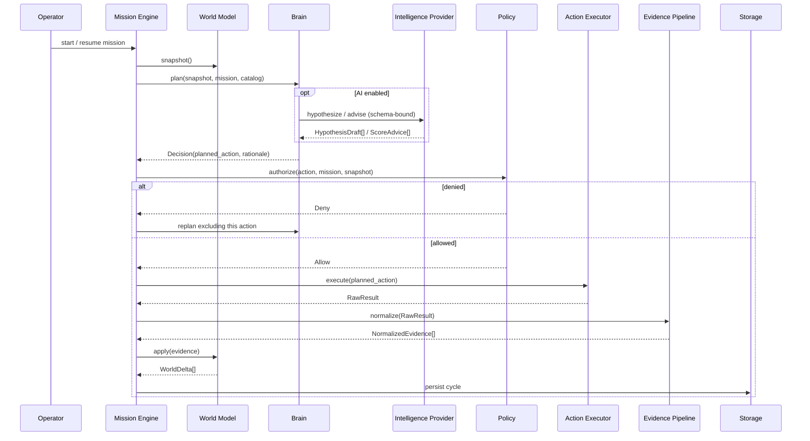

# CyberX v1 Architecture

**Status:** Historical proposal. Binding contract is `docs/SPEC.md`.
**Release:** CyberX v1 CTF Edition — Recon/Intelligence Release
**Scope:** v1 Strategic Recon Brain only
**Stack:** Python 3.10+, Pydantic v2, SQLite (v1), TUI operator console

This document is the architectural contract for CyberX. Implementation must follow it.
Exploitation, persistence, destructive actions, and arbitrary AI-generated command execution are **out of scope for v1** and must be structurally impossible, not merely undocumented.

---

## 1. What CyberX is

CyberX is a **mission-driven adaptive reconnaissance system** for authorized CTFs, HTB/THM-style labs, and authorized security assessments.

It is **not**:

- a scanner wrapper (`nmap → gobuster → ffuf → nuclei → report`)
- an LLM with a shell
- an exploit framework
- a chatbot that “runs pentest tools”

It **is** a closed-loop control system:

```text
Mission
  → Observe
  → Enumerate knowledge gaps
  → Parse evidence
  → Update World Model
  → Generate / revise hypotheses
  → Score allowed actions
  → Select next best action
  → Policy gate
  → Execute catalogued action
  → Observe result
  → Update World Model
  → Re-plan
```

A human operator sets the mission and scope. CyberX then behaves like a junior recon analyst with discipline: it maintains a belief state about the target, notices what it does **not** know, picks the cheapest high-value allowed observation, and updates its beliefs from evidence.

### Hard product rules

| Rule | Meaning |
|---|---|
| Mission-first | No action exists outside a Mission + Scope |
| Catalogued actions only | Tools are adapters behind typed ActionSpecs |
| Policy is a gate, not a hint | Unauthorized actions never reach an executor |
| AI is optional intelligence | AI never owns execution, scope, or policy |
| Evidence is the only source of facts | Hypotheses are not World Model facts |
| v1 is recon-only | Action kinds beyond RECON are unregistered |

---

## 2. Major architectural layers

CyberX uses a **hexagonal (ports & adapters)** layout around a pure domain.

```text
┌─────────────────────────────────────────────────────────────┐
│  Operator UI  ·  CLI  ·  HTTP API  ·  Reports               │  Interface
├─────────────────────────────────────────────────────────────┤
│  Mission Engine (deterministic orchestrator)                │  Application
├───────────────┬───────────────┬───────────────┬─────────────┤
│ Mission       │ Brain         │ World Model   │ Policy      │  Domain
│               │ (planner)     │ (beliefs)     │ (gate)      │
├───────────────┴───────────────┴───────────────┴─────────────┤
│  Action Catalog  ·  Evidence Pipeline  ·  Intelligence      │  Domain services
├─────────────────────────────────────────────────────────────┤
│  Recon Adapters · Storage · AI Providers · Audit Log        │  Adapters
└─────────────────────────────────────────────────────────────┘
```

There is one privileged sequencer: **Mission Engine**. Brain, World Model, Policy, and Executors do not call each other freely. They communicate through typed contracts and the engine.



---

## 3. Layer responsibilities

### 3.1 Interface (UI / CLI / API)

- Create, arm, pause, abort missions
- Show World Model, hypotheses, decisions, evidence, reports
- Never talk to recon tools or AI providers directly

### 3.2 Mission Engine

Owns the loop. The only component allowed to sequence:

1. Load mission + scope + policy profile
2. Take World Model snapshot
3. Ask Brain for a `Decision`
4. Ask Policy to authorize that decision
5. Dispatch to the matching Action Executor
6. Push raw output through Evidence Pipeline
7. Apply `WorldDelta`s
8. Persist snapshot + audit records
9. Repeat or stop

The engine is **deterministic and boring on purpose**. Intelligence lives in Brain. Permission lives in Policy. Facts live in World Model.

### 3.3 Mission

- Natural-language intent plus structured objectives
- Scope (CIDR, hosts, domains, ports, URL prefixes, excluded ranges)
- State machine: `DRAFT → ARMED → RUNNING → PAUSED → COMPLETED | ABORTED | FAILED`
- Constraints: rate, concurrency, max steps, max runtime, tool allowlist
- A mission that is not `ARMED` cannot execute anything

### 3.4 Brain

A **pure planner**. Input: `WorldSnapshot` + `Mission` + `ActionCatalog` view. Output: `Decision`.

Brain:

- enumerates knowledge gaps against mission objectives
- proposes / revises hypotheses
- instantiates candidate actions from the catalog (never invents argv)
- scores candidates
- selects next best action, with a written rationale

Brain **must not**:

- execute
- talk to the network
- write facts into the World Model
- mutate scope
- call subprocesses
- accept free-form shell from an LLM

v1 Brain is **rules-first, AI-second**. A mission must be able to run with `intelligence_provider = none`.

### 3.5 World Model

In-process belief graph of the current target:

- entities (hosts, services, domains, endpoints, technologies, certs)
- relationships
- beliefs with confidence and provenance
- knowledge gaps
- coverage (what was tried, against what, with what result)
- links to hypotheses (as claims, not facts)

### 3.6 Policy

Hard authorization boundary. Evaluates every `PlannedAction` against:

- mission scope
- action class allowlist (v1: `RECON_*` only)
- risk ceiling
- rate / volume limits
- operator approval requirements
- tool availability

Returns `Allow | Deny | RequireApproval`. Deny is terminal for that action. There is no Brain override.

### 3.7 Actions

A **catalog**, not a shell.

Each action is a declared `ActionSpec`:

- stable id (`recon.http.tech_detect`)
- kind (`RECON_HTTP`)
- typed parameter schema
- preconditions against World Model
- expected evidence types produced
- cost, noise, risk
- required binary / capability

Executors receive a validated `PlannedAction` and run a **fixed argv template**. Parameters are interpolated as argv elements, never as `shell=True` strings.

### 3.8 Recon adapters

Thin wrappers over tools (nmap, dns, http, subdomain, directory, tech detect). Each adapter:

- checks the binary exists
- enforces timeouts / output caps
- returns `RawResult` (stdout/stderr hashes, structured bits if available, artifacts)
- never decides “what to do next”

v1 ships **stub adapters** so the loop is testable without tools installed.

### 3.9 Evidence pipeline

```text
RawResult → Parser → NormalizedEvidence → Deduper → WorldDelta
```

Parsers are per-tool, deterministic, and unit-tested against fixtures. AI may *summarize* evidence later; it must not be the parser of record.

### 3.10 Storage

System of record. Durable, queryable, append-heavy:

- missions, scope, policy decisions
- evidence blobs + normalized records
- world snapshots
- hypotheses, decisions, action runs
- audit log

### 3.11 AI providers

Optional `IntelligenceProvider` implementations (Grok, Gemini, Claude, OpenAI, DeepSeek, local). Used only for:

- hypothesis drafts
- advisory scoring / rationale
- evidence summarization
- report prose

Never for execution, scope expansion, or policy.

### 3.12 Observability / audit

Every cycle emits a `DecisionTrace`: snapshot id, candidates, scores, policy verdict, action run id, evidence ids, world deltas. This is how we debug “why did it gobust that path?”

---

## 4. Data flow (one cycle)



**Facts travel one way:** tools → evidence → world. Brain reads the world; it never writes facts.

**Permissions travel one way:** engine → policy → executor. AI never sits on that path.

---

## 5. Package / module structure

Python src layout. Domain packages have **no** `subprocess`, `httpx`, or SDK imports.

```text
cyberx/
  pyproject.toml
  README.md
  docs/ARCHITECTURE.md
  src/cyberx/
    __init__.py
    py.typed
    config.py                  # settings, no secrets in repo
    errors.py
    domain/                    # entities, value objects, enums
      mission.py
      scope.py
      world.py
      evidence.py
      actions.py
      hypotheses.py
      policy.py
      ids.py
    mission/
      service.py
      state_machine.py
    world/
      model.py                 # graph + beliefs
      snapshot.py
      gaps.py
      projectors.py            # evidence → deltas
    brain/
      planner.py               # MissionEngine calls this
      heuristics.py            # deterministic scoring
      hypotheses.py
      gaps.py
    actions/
      catalog.py
      specs/                   # one module per ActionSpec
      executor.py              # dispatch only
    recon/                     # adapters (I/O)
      base.py
      nmap.py
      http.py
      dns.py
      subdomain.py
      directory.py
      tech.py
      stubs.py
    evidence/
      pipeline.py
      parsers/
      normalize.py
      dedupe.py
    policy/
      engine.py
      scope.py
      allowlist.py
      rate_limit.py
    ai/
      protocol.py              # IntelligenceProvider
      schemas.py               # JSON schema / pydantic for LLM I/O
      grok.py
      openai.py
      anthropic.py
      gemini.py
      local.py
      none.py                  # default no-op provider
    storage/
      models.py
      repositories.py
      sqlite.py
    engine/
      loop.py                  # Mission Engine
      cycle.py
    api/                       # FastAPI
      app.py
      routes/
    reporting/
      builder.py
      renderers/
    observability/
      audit.py
      traces.py
    cli.py
  tests/
    unit/
    contract/                  # provider + adapter contracts
    integration/
    fixtures/                  # nmap xml, http dumps, etc.
```

**Import rule:** `domain/` and `brain/` must not import `recon/`, `ai/*` implementations, `api/`, or `storage/` engines. They depend on protocols defined in `domain/` or `ai/protocol.py`.

---

## 6. Core domain entities

All are Pydantic models (or frozen dataclasses) with newtype IDs.

| Entity | Role |
|---|---|
| `Mission` | Intent, objectives, state, constraints |
| `Scope` | Allow/deny of hosts, CIDRs, domains, ports, URL prefixes |
| `TargetRef` | What the operator pointed at (host/domain/URL) |
| `Asset` | Discovered entity: Host, Service, Domain, Endpoint, Certificate, Technology |
| `Belief` | Claim about an asset: value, confidence `0..1`, provenance, observed_at, stale_after |
| `KnowledgeGap` | Something the planner wants to know (open ports? vhosts? app tech?) |
| `Hypothesis` | Explanatory claim, **not a fact** (`maybe wordpress on :80`, `maybe vhost admin.target.htb`) |
| `Evidence` | Normalized observation with raw artifact pointer and parser id |
| `ActionSpec` | Catalog entry (kind, schema, cost, risk, produces) |
| `PlannedAction` | Spec id + validated params + target asset ids |
| `Decision` | Selected action, rejected candidates, scores, rationale |
| `PolicyDecision` | Allow / Deny / RequireApproval + reason codes |
| `ActionRun` | Execution record: start/end, exit, timeout, artifact ids |
| `RawResult` | Bounded stdout/stderr, files, hashes |
| `WorldSnapshot` | Immutable cut of the graph used for one planning cycle |
| `WorldDelta` | Additive/corrective change produced by evidence |
| `DecisionTrace` | Full audit of one OODA cycle |

### Entity rules

- IDs are ULIDs. Never reuse.
- Assets are keyed by canonical identity (`ipv4:10.10.11.23`, `domain:box.htb`, `url:http://box.htb/login`).
- Confidence is explicit. Unparsed banner ≠ “Apache 2.4.49 confirmed”.
- Hypotheses have status: `open | supported | contradicted | retired`.
- Secrets found accidentally (keys, passwords) are redacted in World Model and stored as `SecretRef` handles, not plaintext. v1 does not *seek* credentials.

---

## 7. World Model vs database

These are different things. Collapsing them is the fastest way to build a linear scanner with extra tables.

| | **Database (system of record)** | **World Model (belief state)** |
|---|---|---|
| Question it answers | What happened? | What do we believe *now*, and what don’t we know? |
| Shape | Tables of missions, evidence, runs, snapshots | Graph of assets + beliefs + gaps + coverage |
| Mutability | Append-only evidence/audit; rare updates | Continuously projected from evidence |
| Lifetime | Forever | Rebuilt from storage at process start |
| Used by | Reporting, resume, compliance | Brain, policy, UI “current picture” |
| Includes | Raw artifacts, full traces | Compact, queryable beliefs |
| Uncertainty | Implicit (you can join timestamps) | First-class (`confidence`, `stale`, `unknown`) |

The database stores **events**. The World Model stores **meaning**.

On startup: load latest snapshot (for speed) then replay evidence after that snapshot (for correctness). Snapshots are caches of a projection, not the source of truth.

World Model is allowed to be lossy and opinionated (merge banners, drop duplicate 404s). Evidence is not.

---

## 8. How Brain interacts with World Model

Brain is a **reader**. World Model is updated only by the Evidence projector inside the engine.

```text
WorldSnapshot  ──read──►  Brain.plan()  ──►  Decision
                              │
                              └── may call IntelligenceProvider
                                  for drafts, never for facts

Evidence  ──►  Projector  ──►  WorldDelta  ──►  WorldModel.apply()
```

Brain queries, conceptually:

- `assets(kind=host)`
- `services_without_http_enum()`
- `domains_without_subdomain_enum()`
- `endpoints_with_tech(None)`
- `gaps()`
- `open_hypotheses()`
- `coverage(action_id, asset_id)` — stop repeating failed/useless actions
- `stale_beliefs()`

Then it maps gaps → catalog actions whose preconditions are satisfied.

**Hypotheses are a side channel**, not World Model facts:

1. Brain (or AI) emits `HypothesisDraft`
2. Engine stores them via Hypothesis repository
3. World Model may *index* them for display and scoring
4. Only later evidence can promote a hypothesis to a belief (or contradict it)

This is how we avoid “the model said it’s WordPress, so treat it as WordPress.”

---

## 9. AI providers without giving them security control

AI is a **consultant behind a schema**. The default provider is `none`.

```python
class IntelligenceProvider(Protocol):
    name: str

    def hypothesize(
        self, snapshot: WorldSnapshot, mission: Mission
    ) -> list[HypothesisDraft]: ...

    def advise_scores(
        self, candidates: Sequence[CandidateAction], snapshot: WorldSnapshot
    ) -> list[ScoreAdvice]: ...

    def summarize_cycle(self, trace: DecisionTrace) -> str: ...

    def draft_report_section(self, snapshot: WorldSnapshot) -> str: ...
```

### Binding rules

1. **No tool-calling to a shell.** Providers return JSON that must validate against Pydantic models. Invalid JSON is discarded; the cycle continues with heuristics.
2. **Action ids must exist in the catalog.** If the model suggests `recon.http.dirbust` with params that fail the spec, drop it.
3. **AI cannot introduce new ActionSpecs at runtime.**
4. **AI cannot change Scope, PolicyProfile, or Mission state.**
5. **AI output is advisory.** Heuristic scorer still runs. AI can boost/penalize, not authorize.
6. **Prompt injection is expected.** Tool output is untrusted data. It is placed in clearly delimited evidence blocks and never concatenated into an executable plan.
7. **Secrets and raw tool dumps are truncated / redacted** before any provider call.
8. **Provider implementations live in `ai/`.** Brain depends only on the protocol.
9. **Fail closed on provider errors.** Timeout, 429, garbage → heuristics-only cycle, logged.
10. **Every AI call is audited** (provider, model, tokens, schema version, prompt hash — not necessarily full prompt if it contains target internals the operator wants withheld).

The control plane is CyberX. The model is a plugin.

---

## 10. Extension points for v2 / v3 / v4

Design so later versions **add kinds and gates**, not rewrite the engine.

| Version | Name | What unlocks | What stays locked |
|---|---|---|---|
| v1 | Strategic Recon Brain | `ActionKind.RECON_*` | validate / exploit / persist |
| v2 | Validation & Attack Planning | `RECON_SAFE_VALIDATE_*` (e.g. harmless nuclei tags, login-page confirm, version CVE *mapping* not exploit) | exploit payloads, auth bypass attempts that mutate |
| v3 | Controlled Exploitation | `EXPLOIT_*` behind extra policy + operator approval + lab-only profile | destructive, persistence, C2 |
| v4 | Full Adaptive Pentest Agent | multi-host attack graphs, chaining, adaptive playbooks | still no out-of-scope, still no raw AI shell |

Stable extension interfaces:

1. **`ActionSpec` + executor + parser** — how new tools join
2. **`ActionKind` + `PolicyProfile`** — how dangerous classes stay dark until explicitly enabled
3. **`IntelligenceProvider`** — new models
4. **`WorldProjector`** — new evidence types (creds, session, foothold) land as new node types without changing the graph core
5. **`Planner` protocol** — swap heuristics for a learned policy in v4 without replacing the engine
6. **`ReportRenderer`**
7. **Attack graph layer** (v2+) as a *view* over World Model, not a second source of truth

v1 `ActionKind` enum should already contain future variants, with Policy denying anything that is not `RECON_*` regardless of catalog mistakes.

```python
class ActionKind(StrEnum):
    RECON_PASSIVE = "recon.passive"
    RECON_DNS = "recon.dns"
    RECON_PORTSCAN = "recon.portscan"
    RECON_HTTP = "recon.http"
    RECON_SERVICE = "recon.service"
    VALIDATE = "validate"          # v2
    EXPLOIT = "exploit"            # v3
    POST_EXPLOIT = "post_exploit"  # v4
```

---

## 11. Risks and mistakes to avoid

These are the ways this project dies.

1. **LLM-generated argv / shell.** The failure mode of most “AI pentesters.” Catalog + typed params only.
2. **Brain that executes.** If planner can call nmap, policy becomes optional.
3. **World Model as a list of nmap rows.** Then the planner has nothing to be adaptive *with*. Gaps, coverage, confidence, hypotheses are mandatory.
4. **Linear playbook with a loop around it.** `always nmap then gobuster then nuclei` is not planning. Coverage-aware scoring must be able to skip, reorder, and stop.
5. **Treating hypotheses as facts.** Inflates action selection and poisons reports.
6. **One-provider brain.** Grok/Claude/local must be swappable. Default is `none`.
7. **Scope as documentation.** Scope is code. Every PlannedAction target is checked.
8. **`subprocess(..., shell=True)` and string-built commands.** Argument injection via hostnames/paths is a real recon bug.
9. **Parsing with an LLM.** Banner/XML/JSON parsers are deterministic. LLMs summarize.
10. **No DecisionTrace.** Un-debuggable “why did it do that?”
11. **UI coupled to adapters.** Console talks to Mission/World APIs only.
12. **Premature exploit scaffolding that is actually callable.** Do not ship Metasploit adapters “commented out.” If the executor can load it, Policy must deny *and* the catalog must not register it in v1.
13. **Uncapped tool output into the planner / LLM context.** 50 MB gobuster dumps will wreck the loop. Store artifacts; pass summaries + pointers.
14. **Multi-agent theatre.** v1 needs one engine, one brain, one world. Not six chatty agents.
15. **Building the UI before the loop works in tests.** The first green test is a fake adapter + deterministic planner producing a second cycle that is different from the first.

---

## 12. Recommended implementation order

Do not start with nmap, FastAPI, or an LLM.

| Milestone | Deliverable | Done when |
|---|---|---|
| M0 | Domain models + IDs + enums | Pydantic models import, no I/O |
| M1 | Mission + Scope + state machine | Cannot start an unscoped mission |
| M2 | Policy engine (scope + kind allowlist) | Deny is tested; EXPLOIT denied even if someone instantiates it |
| M3 | Action catalog with 2–3 specs | Params validate; unknown spec id rejected |
| M4 | Stub recon adapters + executor | `shell=True` absent; argv is a list |
| M5 | Evidence parsers + fixtures | nmap-xml / http fixture → NormalizedEvidence |
| M6 | World Model + projector | Two evidence items merge into one host with two services |
| M7 | Storage (SQLite) + snapshot/replay | Kill process, resume, graph identical |
| M8 | Heuristic Brain + Mission Engine loop | Second cycle chooses a *different* action because coverage updated |
| M9 | CLI: create mission, run N cycles, dump world | CTF box hostname in, JSON world out |
| M10 | Operator API + console (read-heavy) | See assets, gaps, last decision, pause/abort |
| M11 | Real adapters: nmap, HTTP, DNS | Behind capability checks; still policy-gated |
| M12 | `IntelligenceProvider` + `none` + one live provider | Heuristics still win if AI is garbage |
| M13 | Directory/subdomain/tech adapters + better scoring | Adaptive on a THM/HTB web box |
| M14 | Reporting | Structured recon report from World Model, optional LLM prose |
| M15 | Hardening | rate limits, output caps, redaction, audit completeness |

**First vertical slice (true v1 demo):** M0–M9 with stubs. That is a working adaptive loop. Tools come after the loop is real.

---

## A. Architecture (summary)

Deterministic **Mission Engine** runs an OODA loop. **Brain** plans from a **World Model** snapshot. **Policy** is a hard gate. **Catalogued recon adapters** execute. **Evidence** is the only writer of facts. **AI providers** are optional, schema-bound advisors. Storage is the system of record; World Model is the derived belief graph.

## B. Package structure (summary)

`domain/`, `mission/`, `world/`, `brain/`, `actions/`, `policy/`, `engine/` are core. `recon/`, `ai/`, `storage/`, `api/` are adapters. Brain and domain have no I/O.

## C. Core entities (summary)

Mission, Scope, Asset, Belief, KnowledgeGap, Hypothesis, Evidence, ActionSpec, PlannedAction, Decision, PolicyDecision, ActionRun, WorldSnapshot, WorldDelta, DecisionTrace.

## D. Interfaces / contracts (summary)

See `docs/CONTRACTS.md` companion section below. The non-negotiable ones: `Planner`, `PolicyEngine`, `ActionExecutor`, `EvidenceParser`, `WorldModel`, `IntelligenceProvider`, `MissionRepository`.

## E. Security boundaries (summary)

- Scope check on every action target
- v1 catalog registers only `RECON_*`
- Policy deny for any other `ActionKind`
- No AI on the execute path
- argv lists, never shell strings
- output caps + secret redaction
- append-only audit
- operator abort is immediate and honored between cycles

## F. Implementation roadmap (summary)

Domain → Mission/Scope/Policy → Catalog/Stubs → Evidence → World Model → Storage → Heuristic loop → CLI → Console → Real tools → Optional AI → Report.

---

## Companion: interfaces (Python)

These are the contracts. Implementations come later; the shapes should not thrash.

```python
from typing import Protocol, Sequence
from enum import StrEnum

class ActionKind(StrEnum):
    RECON_PASSIVE = "recon.passive"
    RECON_DNS = "recon.dns"
    RECON_PORTSCAN = "recon.portscan"
    RECON_HTTP = "recon.http"
    RECON_SERVICE = "recon.service"
    VALIDATE = "validate"
    EXPLOIT = "exploit"
    POST_EXPLOIT = "post_exploit"

class PolicyVerdict(StrEnum):
    ALLOW = "allow"
    DENY = "deny"
    REQUIRE_APPROVAL = "require_approval"


class Planner(Protocol):
    def plan(
        self,
        snapshot: "WorldSnapshot",
        mission: "Mission",
        catalog: "ActionCatalogView",
    ) -> "Decision":
        ...


class PolicyEngine(Protocol):
    def authorize(
        self,
        action: "PlannedAction",
        mission: "Mission",
        snapshot: "WorldSnapshot",
    ) -> "PolicyDecision":
        ...


class ActionExecutor(Protocol):
    spec_id: str

    def execute(
        self, action: "PlannedAction", ctx: "ExecutionContext"
    ) -> "RawResult":
        ...


class EvidenceParser(Protocol):
    produces: tuple[str, ...]

    def parse(self, raw: "RawResult") -> Sequence["NormalizedEvidence"]:
        ...


class WorldModel(Protocol):
    def snapshot(self) -> "WorldSnapshot": ...
    def apply(self, evidence: Sequence["NormalizedEvidence"]) -> list["WorldDelta"]: ...
    def gaps(self) -> list["KnowledgeGap"]: ...


class IntelligenceProvider(Protocol):
    name: str

    def hypothesize(
        self, snapshot: "WorldSnapshot", mission: "Mission"
    ) -> list["HypothesisDraft"]: ...

    def advise_scores(
        self,
        candidates: Sequence["CandidateAction"],
        snapshot: "WorldSnapshot",
    ) -> list["ScoreAdvice"]: ...


class MissionRepository(Protocol):
    def get(self, mission_id: str) -> "Mission": ...
    def save(self, mission: "Mission") -> None: ...
```

Scoring sketch for v1 heuristics (replaceable):

```text
score = (information_gain * mission_relevance * precondition_confidence)
        / (cost * risk * (1 + prior_attempts))
```

Information gain is estimated from KnowledgeGaps the action is declared to close. That is what makes the system adaptive instead of sequential.

---

## v1 non-goals (explicit)

- Exploitation, brute force of credentials, DoS, persistence, C2
- Arbitrary command execution / “run this bash”
- Auto-scope expansion (“I found an adjacent /24, I’ll scan it”)
- Multi-agent debate loops
- Replacing the operator
- Production unattended scanning of third-party assets without an authorization record on the Mission
